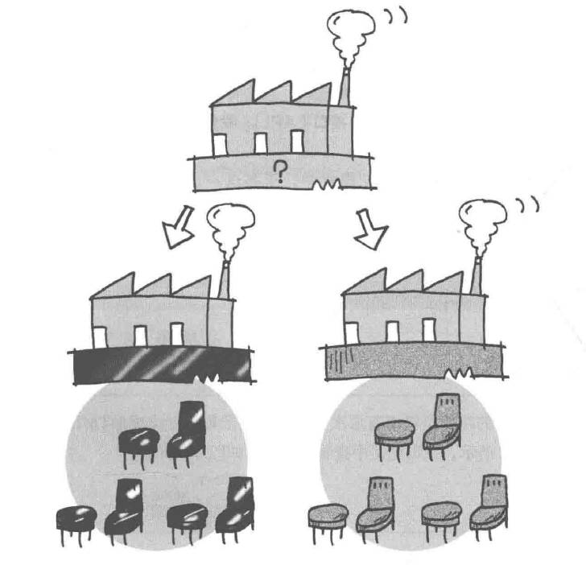

# AbstractFactory模式——将关联零件组装成产品

抽象工厂模式（Abstract Factory Pattern）是围绕一个超级工厂创建其他工厂，属于创建型模式。

在抽象工厂模式中，接口是负责创建一个相关对象的工厂，不需要显式指定它们的类。每个生成的工厂都能按照工厂模式提供对象。

抽象工厂模式提供了一种创建一系列相关或相互依赖对象的接口，而无需指定具体实现类。通过使用抽象工厂模式，可以将客户端与具体产品的创建过程解耦，使得客户端可以通过工厂接口来创建一族产品。

本示例程序将带有层次关系的链接的集合制作成HTML文件。

## 角色

* **AbstractProduct**（抽象产品）：定义了一组产品对象的共同接口或抽象类，描述了产品对象的公共方法。
* **AbstractFactory**（抽象工厂）：声明了一组用于创建产品对象的方法，每个方法对应一种产品类型。抽象工厂可以是接口或抽象类。
* **Client**（委托者）：仅会调用AbstractFactory和AbstractProduct接口进行工作，对具体的零件、产品、工厂一无所知。

## 延伸

Java中可以使用下面方法生成实例：
1. 使用Java关键字`new`生成实例。
2. 使用`clone`方法根据现有实例复制一个新实例，不会调用构造函数。
3. 使用`newInstance`方法通过Class类的实例生成出目标类的实例，会调用无参构造函数。