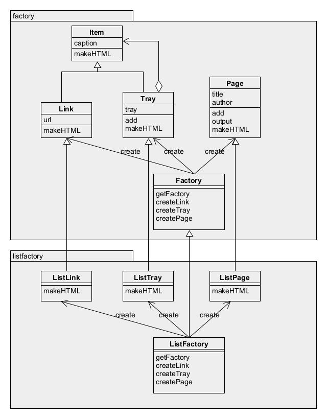

# AbstractFactory模式——将关联零件组装成产品

抽象工厂的工作就是将“抽象零件”组装成“抽象产品”。我们并不关心零件的具体实现而是关心接口。我们仅使用该接口将零件组装成产品。

本示例程序将带有层次关系的链接的集合制作成HTML文件。

## 角色

* **AbstractProduct**（抽象产品）：负责定义AbstractFactory所生成的抽象零件和产品的接口。
* **AbstractFactory**（抽象工厂）：负责定义用于生成抽象产品的接口。
* **Client**（委托者）：仅会调用AbstractFactory和AbstractProduct接口进行工作，对具体的零件、产品、工厂一无所知。

## 拓展思路

* 在抽象工厂模式中增加具体的工厂是非常容易的，无论需要多少具体工厂，都无需修改抽象工厂部分。
* 但在该模式下难以增加新的零件，已编写的具体工厂越多需要修改的工作量越大。

## 延伸

Java中可以使用下面方法生成实例：
1. 使用Java关键字`new`生成实例。
2. 使用`clone`方法根据现有实例复制一个新实例，不会调用构造函数。
3. 使用`newInstance`方法通过Class类的实例生成出目标类的实例，会调用无参构造函数。