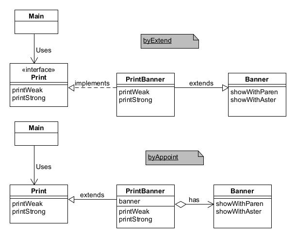

# Adapter模式——加个“适配器”以便于复用

适配器模式（Adapter Pattern）充当两个不兼容接口之间的桥梁，属于结构型设计模式。它通过一个中间件（适配器）将一个类的接口转换成客户期望的另一个接口，使原本不能一起工作的类能够协同工作。

示例程序将输入的字符串显示为`(Hello)`或是`*Hello*`，通过以下两种实现方案：
1. 类适配器模式（使用继承的适配器）
2. 对象适配器模式（使用委托的适配器）

## 角色
* **Target**（目标接口）：定义客户需要的接口。
* **Adaptee**（被适配者类）：定义一个已经存在的接口，这个接口需要适配。
* **Adapter**（适配器类）：实现目标接口，并通过组合或继承的方式调用适配者类中的方法，从而实现目标接口。
