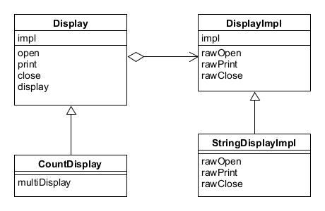

# Bridge模式——将类的功能层次结构与显示层次结构分离

Bridge模式的作用就是在类的功能层次结构与实现层次结构之间搭建桥梁。

* 类的功能层次结构：
  * 父类具有基本功能
  * 在子类中增加新功能
* 类的实现层次结构：
  * 父类通过声明抽象方法来定义接口
  * 子类通过实现具体方法来实现接口

示例程序的功能是显示一些东西。

## 角色

* **Abstraction**（抽象化）：位于类的**功能**层次结构最上层，使用Implementor角色的方法定义了基本功能。
* **RefinedAbstraction**（改良后的抽象化）：在Abstraction角色的基础上增加了新功能的角色。
* **Implementor**（实现者）：位于类的**实现**层次结构最上层，定义了用于实现Abstraction角色的接口方法。
* **ConcreteImplementor**（具体实现者）：负责实现在Implementor中定义的接口。

## 拓展思路

* 将类的两个层次结构分开有利于独立地对他们进行扩展。
* 虽然使用继承很容易扩展类，但类之间会形成一种强关联关系。所以使用委托来代替继承关系，如本例中使用impl字段保存实现的实例，将类的任务转移给impl去实现。