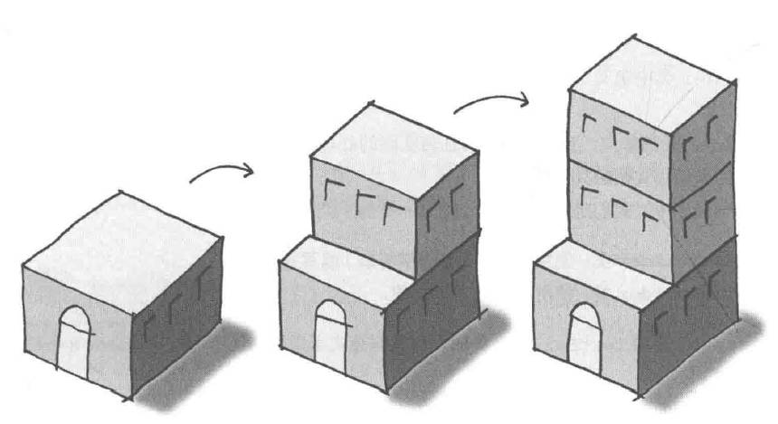
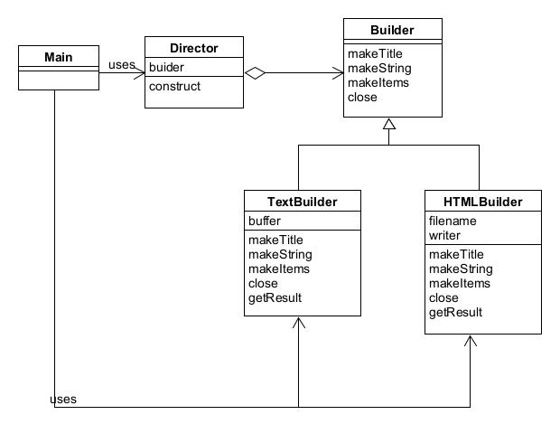

# Builder模式——组装复杂的实例

建造者模式是一种创建型设计模式，它的主要目的是将一个复杂对象的构建过程与其表示相分离，从而可以创建具有不同表示形式的对象。

示例程序使用Builder模式编写文档程序，该文档具有以下结构：含有一个标题，含有若干个字符串，含有条目项目。

## 角色

* **Builder**（抽象建造者）：定义了构建产品的抽象接口，包括构建产品的各个部分的方法。
* **ConcreteBuilder**（具体的建造者）：负责实现Builder角色的接口类。
* **Director**（指导者）：负责调用建造者的方法来构建产品，指导者并不了解具体的构建过程，只关心产品的构建顺序和方式。
