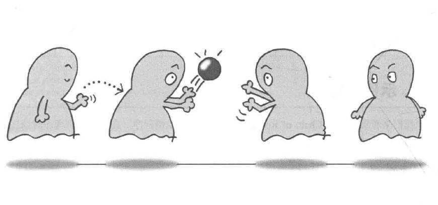

# Chain of Responsibility模式——推卸责任

责任链模式（Chain of Responsibility Pattern）属于行为型模式，为请求创建了一个接收者对象的链。

责任链模式通过将多个处理器（处理对象）以链式结构连接起来，使得请求沿着这条链传递，直到有一个处理器处理该请求为止。 责任链模式允许多个对象都有机会处理请求，从而避免请求的发送者和接收者之间的耦合关系。

实例程序是一个多人推卸责任处理问题场景。

## 角色

* **Handler**（处理者）：定义一个方法用于处理请求。
* **ConcreteHandler**（具体的处理者）：实现Handler接口，包含请求处理逻辑和对下一个处理者的引用。