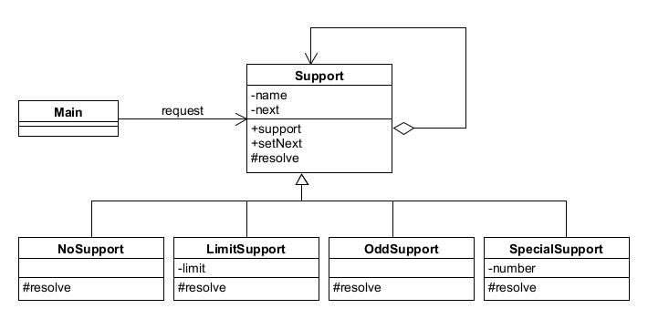

# Chain of Responsibility模式——推卸责任

责任链模式将多个对象组成一条责任链，然后按照他们在职责链上的顺序一个一个找出到底谁来负责处理。

实例程序是一个多人推卸责任处理问题场景。

## 角色

* **Handler**（处理者）：定义处理请求的接口，知道下一个处理者是谁，若自己无法处理请求，将请求转给下一个处理者。
* **ConcreteHandler**（具体的处理者）：处理请求的具体角色。
* **Client**（请求者）：向第一个ConcreteHandler角色发送请求。