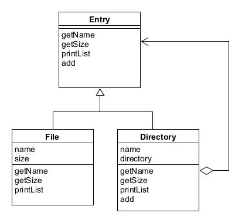

# Composite模式——容器与内容的一致性

能够使容器与内容具有一致性，创造出递归结构的模式就是Composite模式。

示例程序功能是列出文件和文件夹的一览。

## 角色

* **Leaf**（树叶）：表示内容的角色，不能放入其他对象。
* **Composite**（复合物）：表示容器的角色，可以在其中放入Leaf角色和Composite角色。
* **Component**（组件）：使Leaf角色和Composite角色具有一致性的角色。
* **Client**（调用者）：使用Composite模式的角色。

## 拓展思路

* 使用 Composite 模式可以使容器与内容具有一致性，也可以称其为多个和单个的一致性，即将多个对象结合在一起，当作一个对象进行处理。