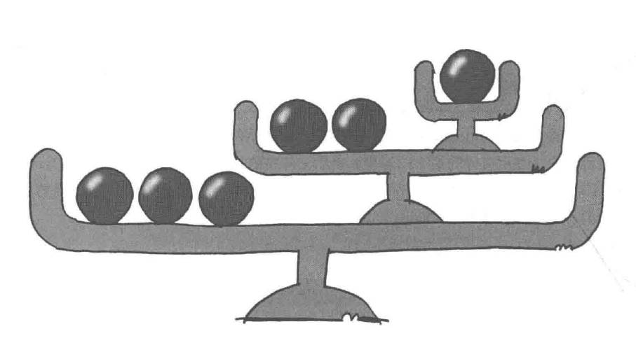

# Composite模式——容器与内容的一致性

组合模式（Composite Pattern），又叫部分整体模式，是用于把一组相似的对象当作一个单一的对象。组合模式依据树形结构来组合对象，用来表示部分以及整体层次。属于结构型模式。

这种模式创建了一个包含自己对象组的类。该类提供了修改相同对象组的方式。

示例程序功能是列出文件和文件夹的一览。

## 角色

* **Leaf**（树叶）：表示组合中的叶子节点对象，叶子节点没有子节点。它实现了组件接口的方法，但通常不包含子组件。
* **Composite**（复合节点）：表示组合中的复合对象，复合节点可以包含子节点，可以是叶子节点，也可以是其他复合节点。它实现了组件接口的方法，包括管理子组件的方法。
* **Component**（组件）：定义了组合中所有对象的通用接口，可以是抽象类或接口。它声明了用于访问和管理子组件的方法，包括添加、删除、获取子组件等。
* **Client**（调用者）：通过组件接口与组合结构进行交互，客户端不需要区分叶子节点和复合节点，可以一致地对待整体和部分。

