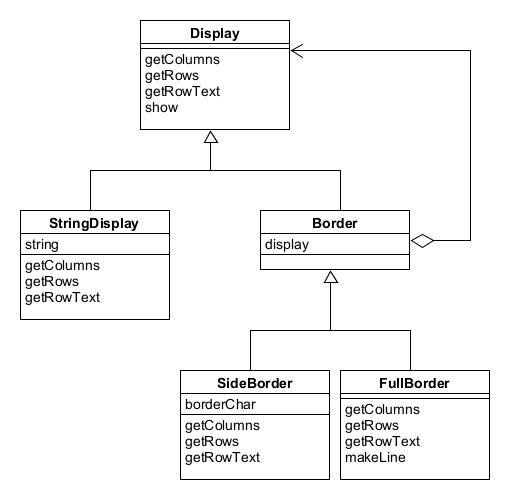

# Decorator模式——装饰与被装饰物的一致性

不断地为对象添加装饰地是寂寞时被称为Decorator模式。

示例程序功能时给文字添加装饰边框。

## 角色

* **Component**（组件）：需要增加功能地核心角色。
* **ConcreteComponent**（具体组件）：实现了Component角色所定义地接口的具体组件。
* **Decorator**（装饰边框）：具有与Component相同的接口。
* **ConcreteDecorator**（具体装饰边框）：具体的装饰物。

## 拓展思路

* 在装饰者模式中，装饰边框与被装饰物具有一致性，表示装饰边框的类是被装饰物的子类，具有相同的接口。
* 不需要对被装饰的类做任何修改，即可增加功能。装饰者模式使用了委托，对装饰边框提出的要求会被转交给被装饰物去处理。