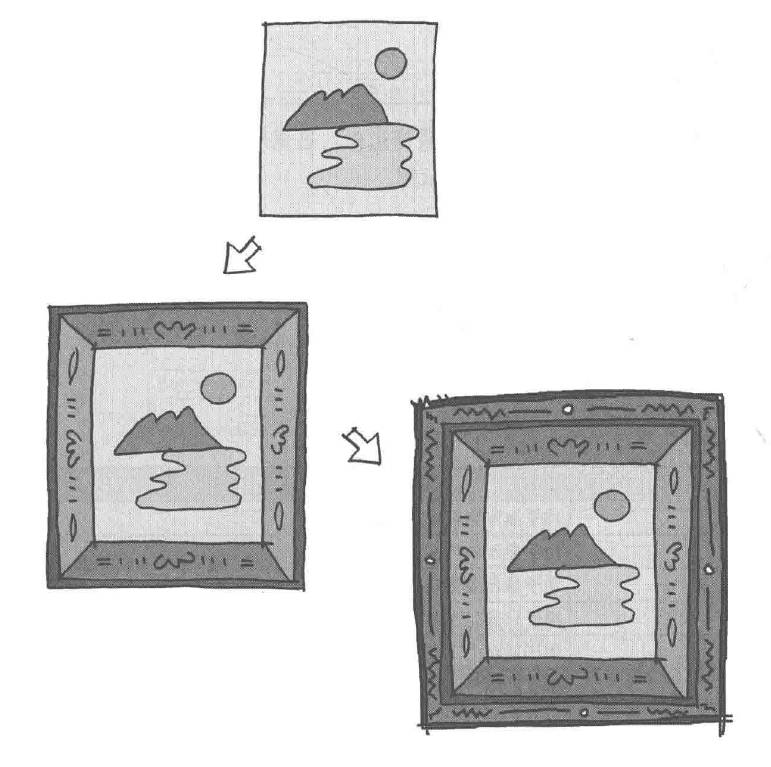

# Decorator模式——装饰与被装饰物的一致性

装饰器模式（Decorator Pattern）允许向一个现有的对象添加新的功能，同时又不改变其结构，属于结构型模式。

这种模式创建了一个装饰类，用来包装原有的类，并在保持类方法签名完整性的前提下，提供了额外的功能。

示例程序功能时给文字添加装饰边框。

## 角色

* **Component**（抽象组件）：定义了原始对象和装饰器对象的公共接口或抽象类，可以是具体组件类的父类或接口。
* **ConcreteComponent**（具体组件）：被装饰的原始对象，它定义了需要添加新功能的对象。
* **Decorator**（抽象装饰器）：继承自抽象组件，它包含了一个抽象组件对象，并定义了与抽象组件相同的接口，同时可以通过组合方式持有其他装饰器对象。
* **ConcreteDecorator**（具体装饰器）：实现了抽象装饰器的接口，负责向抽象组件添加新的功能。具体装饰器通常会在调用原始对象的方法之前或之后执行自己的操作。

