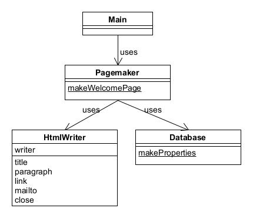

# Facade模式——简单窗口

使用Facade模式可以为互相关联在一起的错综复杂的类整理出高层接口。

示例程序编写了简单的Web页面。

## 角色

* **Facade**（窗口）：代表构成系统的许多其他角色的简单窗口，向外部提供高层接口。
* **Component**（构成系统的其他组件）：各自完成自己的工作，并不知道Facade角色。
* **Client**（请求者）：调用Facade角色。