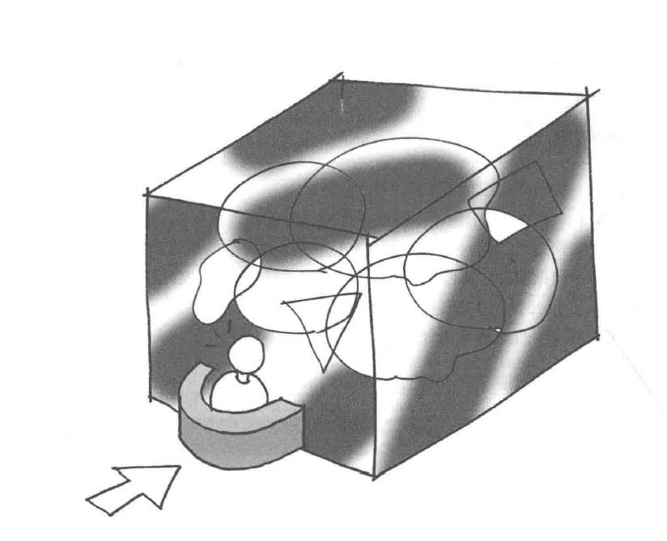

# Facade模式——简单窗口

外观模式（Facade Pattern）属于结构型模式，隐藏系统的复杂性，并向客户端提供了一个客户端可以访问系统的接口。

这种模式涉及到一个单一的类，该类提供了客户端请求的简化方法和对现有系统类方法的委托调用。

示例程序编写了简单的Web页面。

## 角色

* **Facade**（外观）：提供一个简化的接口，封装了系统的复杂性。外观模式的客户端通过与外观对象交互，而无需直接与系统的各个组件打交道。
* **Subsystem**（子系统）：由多个相互关联的类组成，负责系统的具体功能。外观对象通过调用这些子系统来完成客户端的请求。
* **Client**（请求者）：使用外观对象来与系统交互，而不需要了解系统内部的具体实现。