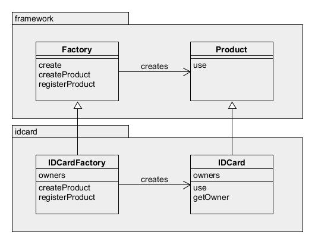

# Factory Method模式——将实例的生成交给子类

在工厂方法模式中，父类决定实例的生成方式，但不决定所要生成的具体的类，具体处理全部交给子类负责。这样可以将生成实例的框架（framework）和负责实际生成实例的类解耦。

示例程序是制作身份证。



## 角色

* **Creator**（创造者）：属于框架一方，负责生成Product角色的抽象类，具体处理由子类决定
* **Product**（产品）：抽象类，定义工厂方法模式中生成所有实例所持有的接口，但具体处理由子类决定。
* **ConcreteCreator**（具体的创建者）：生成具体的产品。
* **ConcreteProduct**（具体的产品）：决定具体加工的产品。

## 拓展

生成实例的三种实现方式：
1. 指定其为抽象方法。一旦指定为抽象方法子类必须实现该方法，否则报告编译错误。
    ```java
    abstract class Factory {
        public abstract Product createProduct(String name);
    }
    ```
2. 为其实现默认处理。若子类没有实现该方法则按默认处理。
    ```java
    class Factory {
        public Product createProduct(String name){
            return new Product(name);
        }
    }
    ```
3. 在其中抛出异常。若未实现该方法，程序只会在运行时出错。
    ```java
    class Factory {
        public Product createProduct(String name){
            throw new FactoryMethodRuntimeException();
        }
    }
    ```