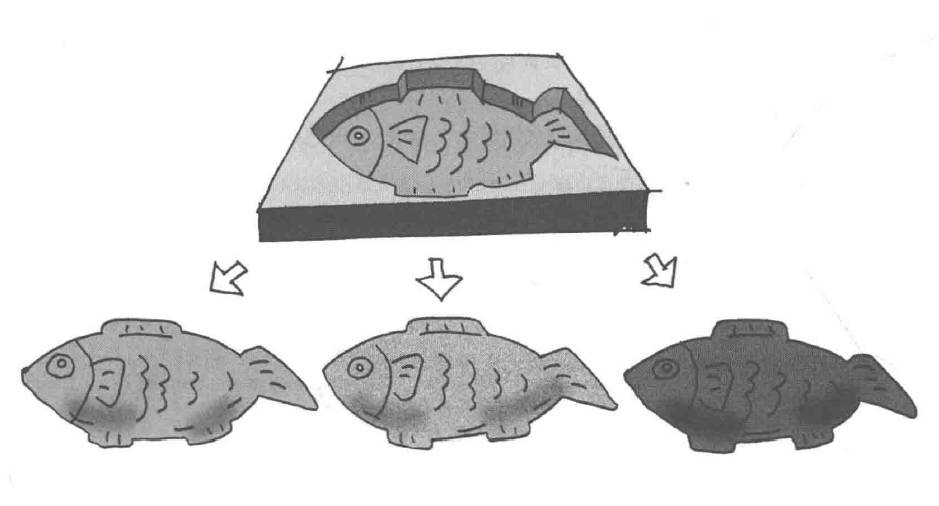

# Factory Method模式——将实例的生成交给子类


工厂模式（Factory Pattern）提供了一种创建对象的方式，而无需指定要创建的具体类，使得创建对象的过程与使用对象的过程分离。

通过使用工厂模式，可以将对象的创建逻辑封装在一个工厂类中，而不是在客户端代码中直接实例化对象，这样可以提高代码的可维护性和可扩展性。

工厂模式的类型：
1. **简单工厂模式**（Simple Factory Pattern）： 
   * 它使用一个单独的工厂类来创建不同的对象，根据传入的参数决定创建哪种类型的对象。
2. **工厂方法模式**（Factory Method Pattern）：
   * 工厂方法模式定义了一个创建对象的接口，但由子类决定实例化哪个类。工厂方法将对象的创建延迟到子类。
3. **抽象工厂模式**（Abstract Factory Pattern）：
   * 抽象工厂模式提供一个创建一系列相关或互相依赖对象的接口，而无需指定它们具体的类。
   
示例程序是制作身份证。在工厂方法模式中，父类决定实例的生成方式，但不决定所要生成的具体的类，具体处理全部交给子类负责。这样可以将生成实例的框架（framework）和负责实际生成实例的类解耦。


## 角色

* **Creator**（创造者）：属于框架一方，负责生成Product角色的抽象类，具体处理由子类决定
* **Product**（抽象产品）：定义了产品的共同接口或抽象类。定义工厂方法模式中生成所有实例所持有的接口，但具体处理由子类决定。
* **ConcreteCreator**（具体的创建者）：生成具体的产品。
* **ConcreteProduct**（具体的产品）：决定具体加工的产品。

## 拓展

生成实例的三种实现方式：
1. 指定其为抽象方法。一旦指定为抽象方法子类必须实现该方法，否则报告编译错误。
    ```java
    abstract class Factory {
        public abstract Product createProduct(String name);
    }
    ```
2. 为其实现默认处理。若子类没有实现该方法则按默认处理。
    ```java
    class Factory {
        public Product createProduct(String name){
            return new Product(name);
        }
    }
    ```
3. 在其中抛出异常。若未实现该方法，程序只会在运行时出错。
    ```java
    class Factory {
        public Product createProduct(String name){
            throw new FactoryMethodRuntimeException();
        }
    }
    ```