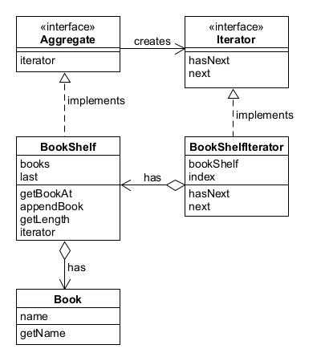

# Iterator模式——一个一个遍历

迭代器模式提供一种方法顺序访问一个聚合对象中的各个元素，而又不暴露其内部的表示。

示例程序作用将书Book放置到书架BookShelf中，并将书的名字按顺序显示出来。

## 角色
* **Iterator**（迭代器接口）：定义了访问和遍历聚合对象中各个元素的方法，通常包括获取下一个元素、判断是否还有元素、获取当前位置等方法。
* **ConcreteIterator**（具体迭代器）：实现了迭代器接口，负责对聚合对象进行遍历和访问，同时记录遍历的当前位置。
* **Aggregate**（聚合对象接口）：定义了创建迭代器对象的接口，通常包括一个工厂方法用于创建迭代器对象。
* **ConcreteAggregate**（具体聚合对象）：实现了聚合对象接口，负责创建具体的迭代器对象，并提供需要遍历的数据。

