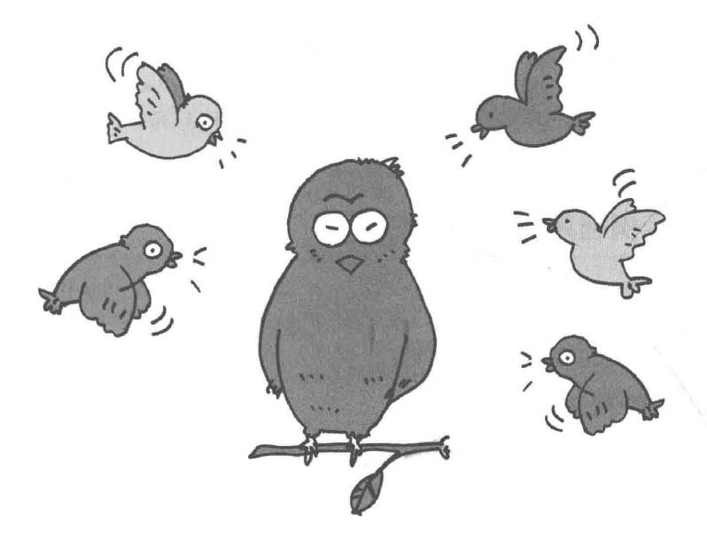
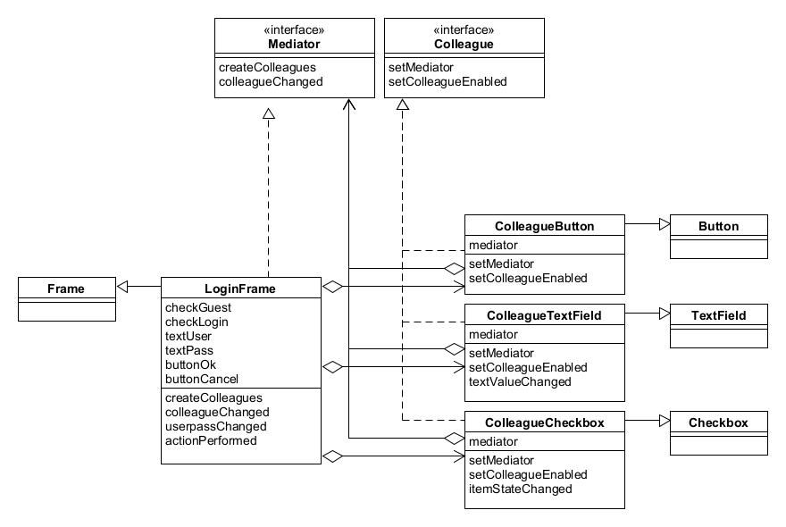
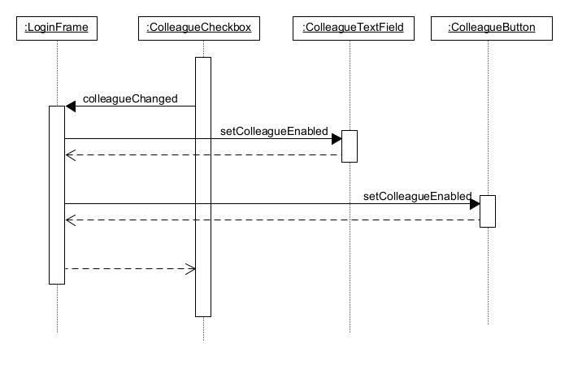

# Mediator模式——只有一个仲裁者

中介者模式（Mediator Pattern）是用来降低多个对象和类之间的通信复杂性，属于行为型模式。

中介者模式定义了一个中介对象来封装一系列对象之间的交互。中介者使各对象之间不需要显式地相互引用，从而使其耦合松散，且可以独立地改变它们之间的交互。

示例程序是一个GUI应用程序，展示了一个登录对话框。

## 角色

* **Mediator**（仲裁者、中介者）：定义了一个接口用于与各个同事对象通信，并管理各个同事对象之间的关系。通常包括一个或多个事件处理方法，用于处理各种交互事件。
* **Colleague**（同事对象）：定义了一个接口，用于与中介者进行通信。通常包括一个发送消息的方法，以及一个接收消息的方法。
* **ConcreteMediator**（具体仲裁者）：实现了中介者接口，负责实现各个同事对象之间的通信逻辑。它会维护一个对各个同事对象的引用，并协调它们的交互。
* **ConcreteColleague**（具体同事）：实现了同事对象接口，是真正参与到交互中的对象。它会将自己的消息发送给中介者，由中介者转发给其他同事对象。