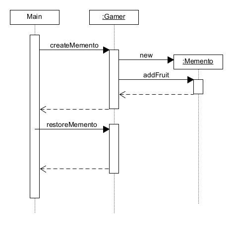

# Memento模式——保存对象状态

备忘录模式（Memento Pattern）属于行为型模式，保存一个对象的某个状态，允许在不破坏封装性的前提下，捕获和恢复对象的内部状态。

示例程序是一个收集水果和获得金钱数的掷骰子游戏。

## 角色

* **Originator**（原发器）：创建一个备忘录对象，并且可以使用备忘录对象恢复自身的内部状态。原发器通常会在需要保存状态的时候创建备忘录对象，并在需要恢复状态的时候使用备忘录对象。
* **Memento**（备忘录）：负责存储原发器对象的内部状态。备忘录可以保持原发器的状态的一部分或全部信息。
* **Caretaker**（负责人）：负责保存备忘录对象，但是不对备忘录对象进行操作或检查。负责人只能将备忘录传递给其他对象。