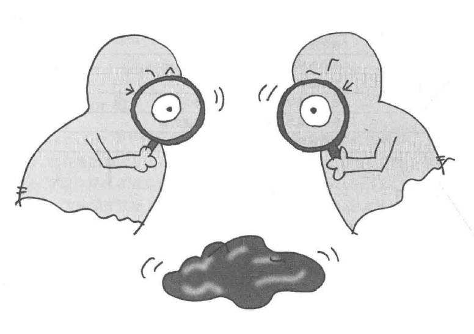
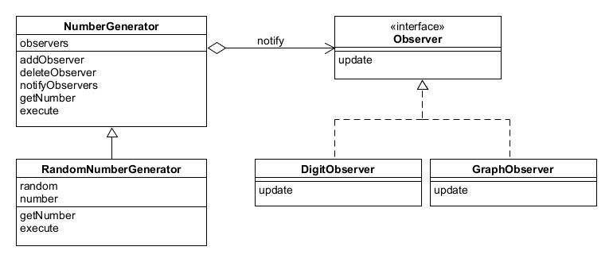

# Observer模式——发送状态变化通知

观察者模式是一种行为型设计模式，它定义了一种一对多的依赖关系，当一个对象的状态发生改变时，其所有依赖者都会收到通知并自动更新。

示例程序中的观察者将观察一个会生成数值的对象并显示出来，不同观察者显示方式不同。

## 角色

* **Subject**（观察对象）：表示被观察对象，定义了注册和删除观察者的方法，还声明了获取现在的状态的方法。
* **ConcreteSubject**（具体的观察对象）：表示具体的被观察对象，自身发个声变化后会通知所有已经注册的Observer角色。
* **Observer**（观察者）：负责接收来自Subject角色的状态变化的通知。
* **ConcreteObserver**（具体的观察者）。