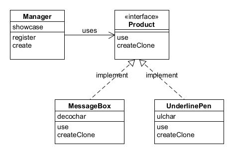

# Prototype模式——通过复制生成实例

不根据类生成实例，而是根据实例来生成新实例的Prototype模式。

示例程序将字符串放入方框中显示出来或者加上下划线显示出来。

## 角色
* **Prototype**（原型）：负责定义用于复制现有实例来生成新实例的方法，如此例中Product接口。
* **ConcretePrototype**（具体原型）：负责实现现有实例并生成新实例的方法。
* **Client**（使用者）：负责使用复制实例的方法生成新实例，此例中的Manager类。

## 拓展思路
* 不能直接根据类生成实例吗，什么情况下使用原型模式呢？
  * 对象样式种类繁多无法整合到一个类中，例如本例中出现的三种样式；
  * 难以根据类生成实例，根据现有实例生成新实例更方便；
  * 想解耦框架与生成的实例时，例如本例将复制的部分封装在framework包中。
* 原程序中使用类名是束缚吗？面向对象编程的目标之一即**作为组件复用**，一旦代码中出现要使用的类的名字，就无法与该类分离开来，也就难以实现复用。

## 延伸

* 想要调用clone方法，被复制的对象的类必须实现 `java,lang.Cloneable` 接口，不过不论是被复制对象或是其某个父类实现Cloneable接口都可以。
* `clone()` 方法定义在 `java.lang.Object`中，所有Java类都继承了clone方法。
* `Cloneable`接口中并未声明任何方法，只是用来表示“可以使用clone方法进行复制”的，这种接口被称为**标记接口**（marker interface）。
* clone方法所进行的复制是**浅复制**，只是将被复制实例的字段值直接复制到新的实例中，没有考虑字段中所保存的实例内容。例如字段中保存的是数组，则只会复制该数组的引用而非数组内的元素。