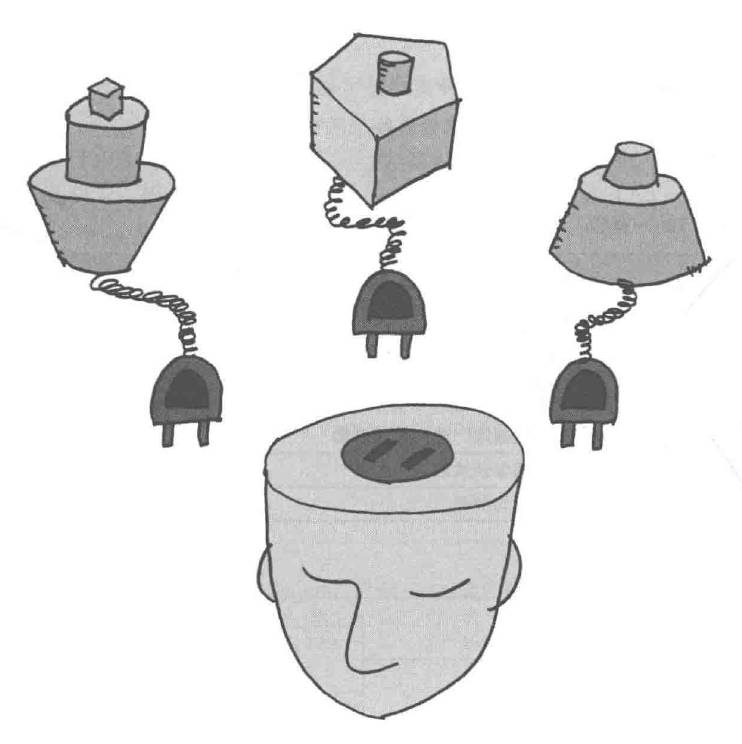

# Strategy模式——整体地替换算法

策略模式通过将算法与使用算法的代码解耦，提供了一种动态选择不同算法的方法。客户端代码不需要知道具体的算法细节，而是通过调用环境类来使用所选择的策略。
示例程序让电脑玩猜拳。

## 角色

* **AbstractStrategy**（抽象策略）：定义了策略对象的公共接口或抽象类，规定了具体策略类必须实现的方法。
* **ConcreteStrategy**（具体策略）：实现了抽象策略定义的接口或抽象类，包含了具体的算法实现。
* **Context**（上下文环境）：维护一个对策略对象的引用，负责将客户端请求委派给具体的策略对象执行。环境类可以通过依赖注入、简单工厂等方式来获取具体策略对象。