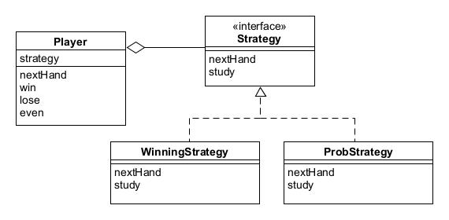

# Strategy模式——整体地替换算法

Strategy模式允许我们整体替换算法，能够轻松地以不同方法解决同一个问题。

示例程序让电脑玩猜拳。

## 角色

* **Strategy**（策略）：决定实现策略所必须的接口。
* **ConcreteStrategy**（具体策略）：实现具体的策略。
* **Context**（上下文）：负责使用Strategy，保存了ConcreteStrategy的实例，并使用ConcreteStrategy去实现需求。