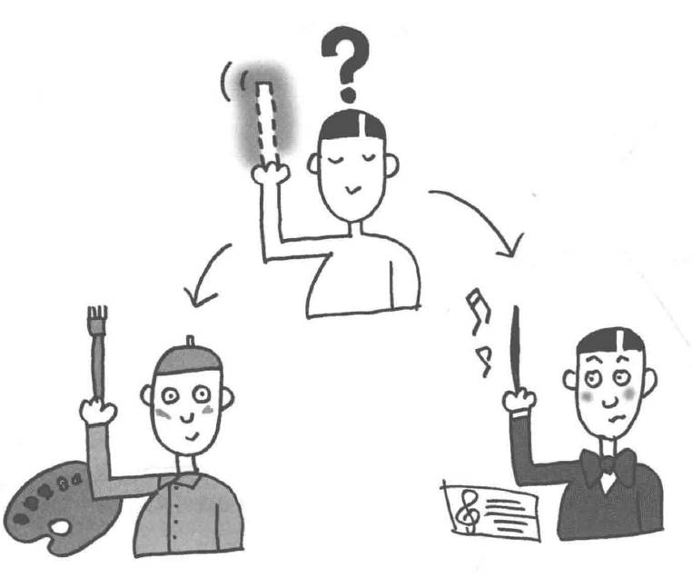

# Template Method模式——将具体处理交给子类

在模板模式（Template Pattern）中，一个抽象类公开定义了执行它的方法的方式/模板。它的子类可以按需要重写方法实现，但调用将以抽象类中定义的方式进行。这种类型的设计模式属于行为型模式。

示例程序是一段将字符和字符串循环显示五次的程序。

## 角色
* **AbstractClass**（抽象父类）：定义了模板方法和一些抽象方法或具体方法。
* **ConcreteClass**（具体子类）：继承自抽象父类，并实现抽象方法。
* **Hook Method**（钩子方法）：可选项，在抽象父类中*定义，可以被子类重写，以影响模板方法的行为。