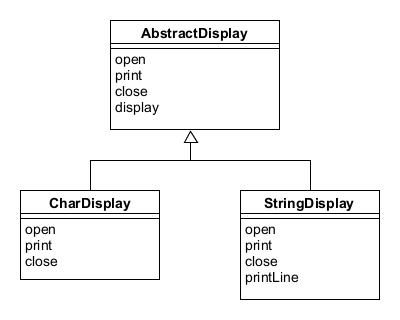

# Template Method模式——将具体处理交给子类

在父类中定义处理流程的框架，在子类中实现具体处理的模式称为Template Method模式。

示例程序是一段将字符和字符串循环显示五次的程序。

## 角色

* **AbstractClass**（抽象类）：负责实现模板方法，还负责声明模板方法中所使用到的抽象方法。
* **ConcreteClass**（具体类）：具体实现AbstractClass角色定义的抽象方法，会在模板方法中被调用。

## 拓展思路

* 由于已在父类的模板方法中编写了算法，因此无需在子类中再编写些算法。
* 无论父类类型的变量中保存哪个子类的实例，程序都可以正常工作，这种原则被称为里氏替换原则（The Liskov Substitution Principle）。