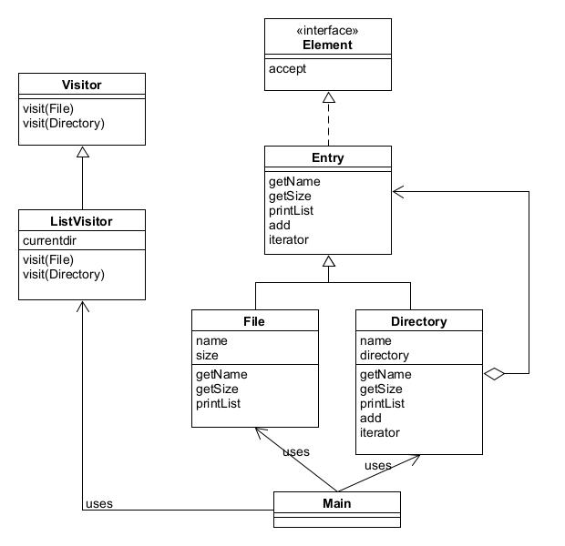
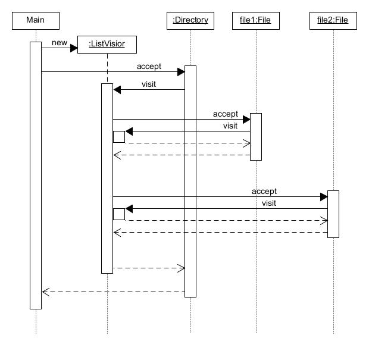

# Visitor模式——访问数据结构并处理数据

Visitor模式中数据结构与处理分离开。

示例程序访问由文件和文件夹构成的数据结构然后夏娜实处文件的一览。

当一个文件夹下有两个文件时，示例程序处理流程：

展示了Element类中的`accept()`和Visitor类中的`visit()`递归调用的逻辑流程。

## 角色

* **Visitor**（访问者）：负责对数据结构中每个具体的元素声明一个用于访问的方法。
* **ConcreteVisitor**（具体访问者）：实现Visitor定义的接口。
* **Element**（元素）：Visitor访问对象。
* **ConcreteElement**（实际元素）：负责实现Element所定义的接口。
* **ObjectStructure**（对象结构）：负责处理Element橘色的集合。