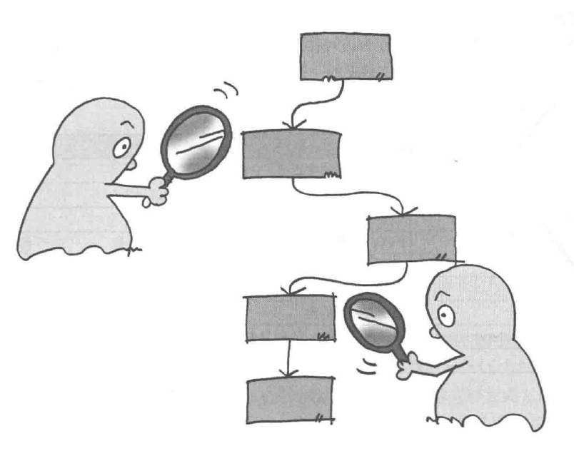

# Visitor模式——访问数据结构并处理数据

Visitor模式中数据结构与处理分离开。

在访问者模式（Visitor Pattern）中，使用一个访问者类改变元素类的执行算法，属于行为模式。通过这种方式，元素的执行算法可以随着访问者改变而改变。旨在将数据结构与在该数据结构上执行的操作分离，从而使得添加新的操作变得更容易，而无需修改数据结构本身。

当一个文件夹下有两个文件时，示例程序处理流程：

展示了Element类中的`accept()`和Visitor类中的`visit()`递归调用的逻辑流程。

## 角色

* **Visitor**（访问者）：负责对数据结构中每个具体的元素声明一个用于访问的方法。
* **ConcreteVisitor**（具体访问者）：实现访问者接口，提供对每个具体元素类的访问和相应操作。
* **Element**（元素）：定义了一个接受访问者的方法。
* **ConcreteElement**（实际元素）：实现元素接口，提供一个accept方法，允许访问者访问并操作。
* **ObjectStructure**（对象结构）：定义了如何组装具体元素。